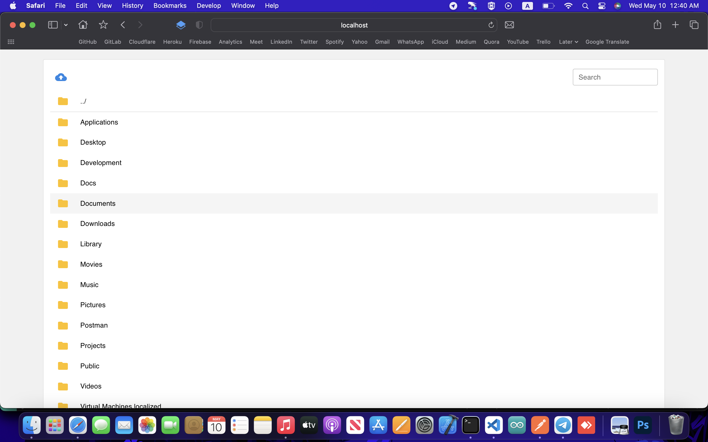
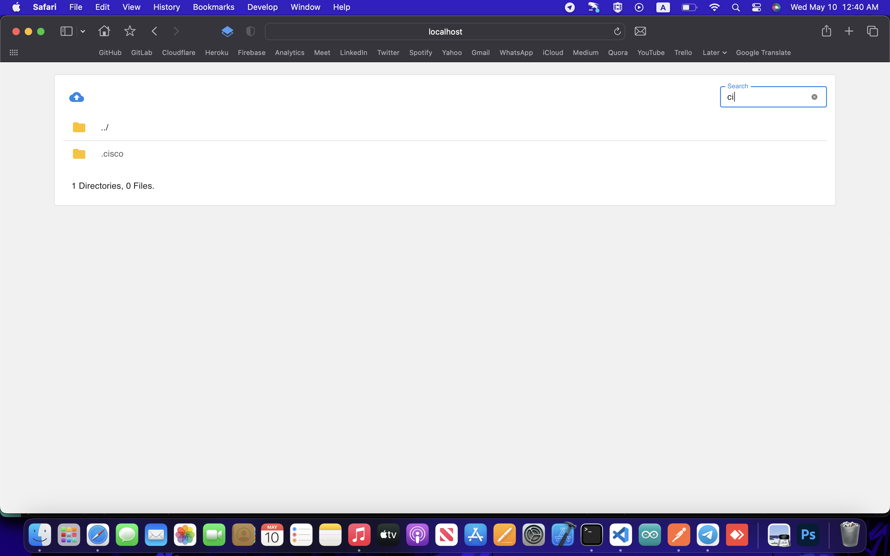
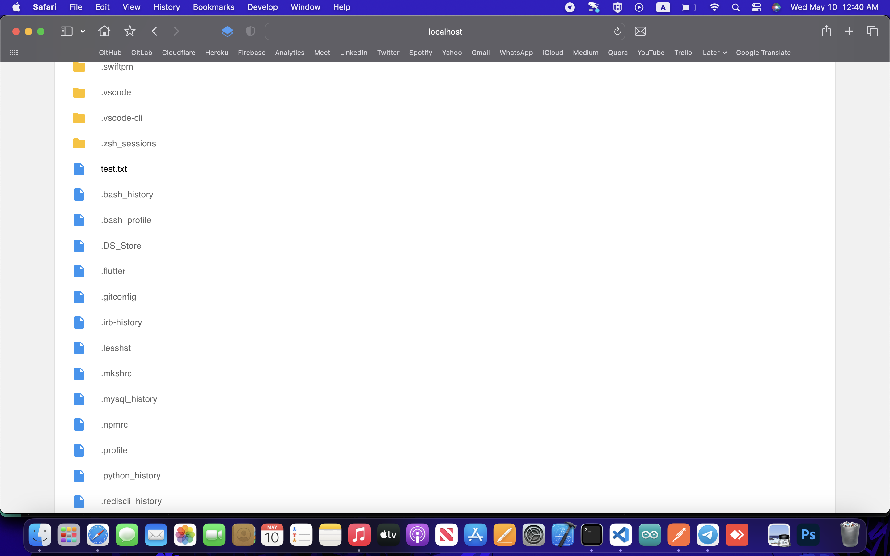
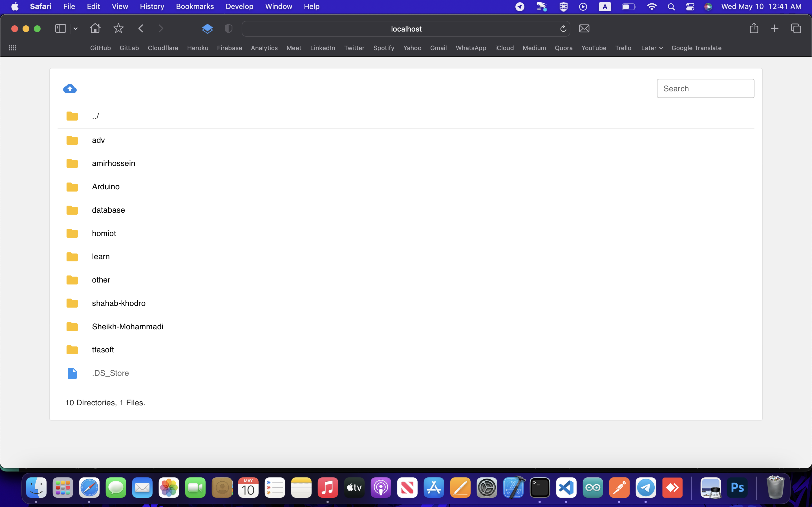

# File Manager API

The **File Manager** project application.

Filemanager is an application you can install on your server to manage files in web. You can upload, delete, navigate and many other features. This is the server side of the project. The client side is https://github.com/BlackIQ/filemanager-client.

## Tech

- NodeJs
- ExpressJs

## Overview

